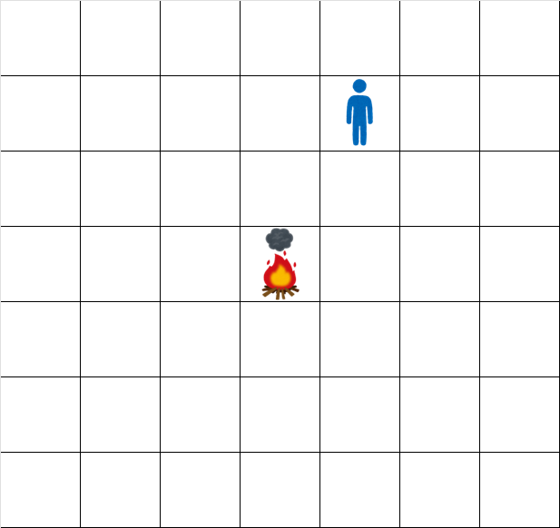
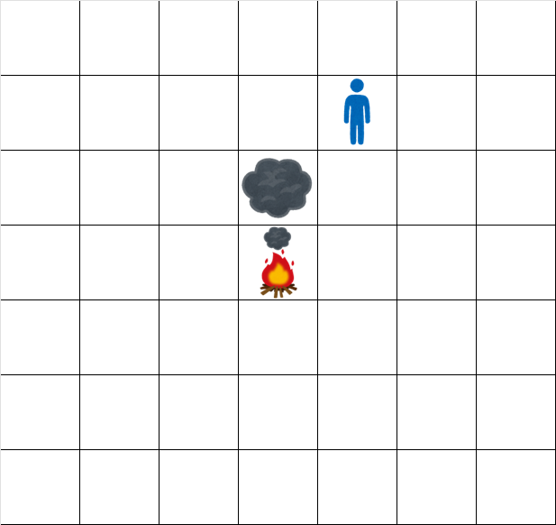
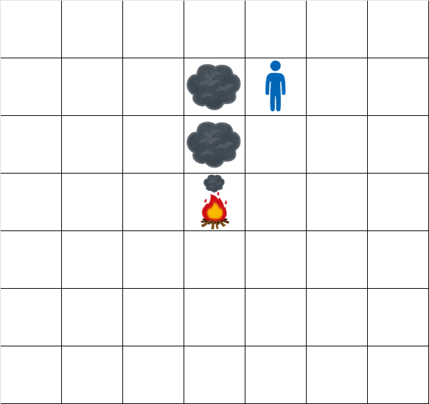
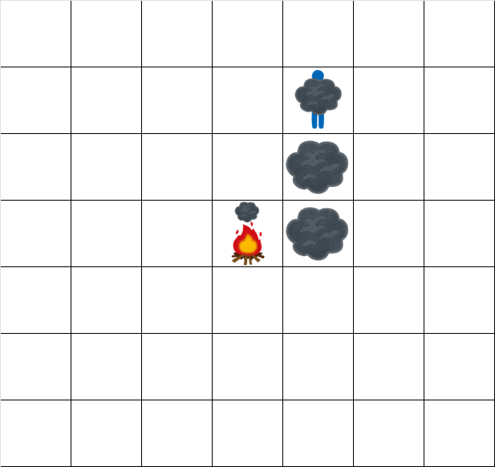
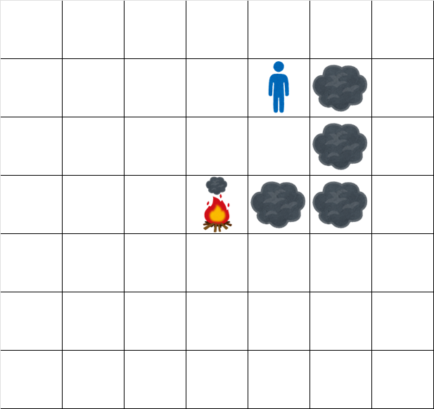
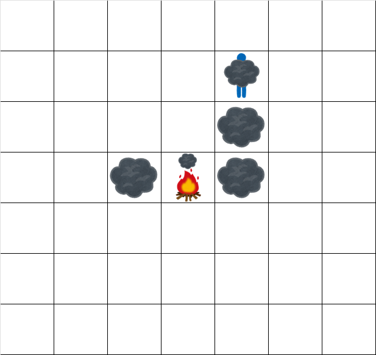
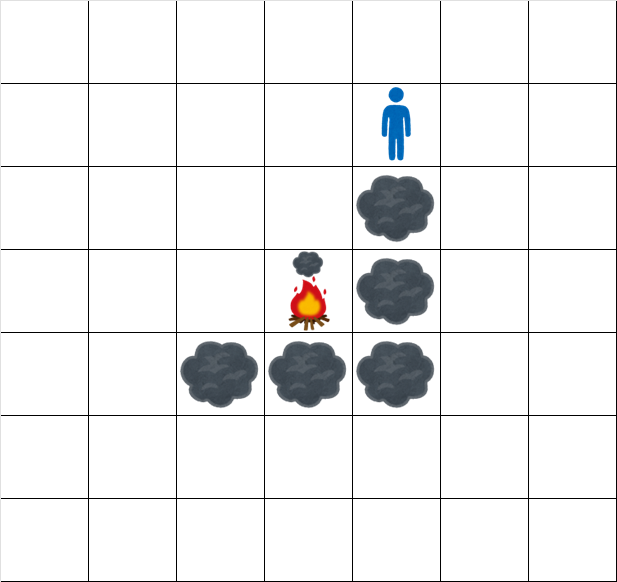

# D - Bonfire

Time Limit: 2 sec / Memory Limit: 1024 MB
Score : 425 points

## Problem Statement
There is an infinitely large two-dimensional grid, with a campfire at coordinate (0,0).
At time t=0, smoke exists only at cell (0,0).

You are given a length-N string S consisting of N, W, S, E. At times t=1,2,…,N, the following happen in order:

* Wind blows, and all the smoke present at that time moves as follows:
    * If the t-th character of S is N, smoke in cell (r,c) moves to cell (r−1,c).
    * If it is W, smoke in cell (r,c) moves to cell (r,c−1).
    * If it is S, smoke in cell (r,c) moves to cell (r+1,c).
    * If it is E, smoke in cell (r,c) moves to cell (r,c+1).
* If there is no smoke in cell (0,0), new smoke is generated at cell (0,0).

Takahashi is standing at cell (R,C).
For each integer 1≤t≤N, determine if smoke exists at cell (R,C) at time t+0.5, and print the response according to the required format.

## Constraints
* N is an integer between 1 and 200000, inclusive.
* S is a length N string consisting of N, W, S, E. 
* R and C are integers between −N and N, inclusive.
* $$(R,C)\neq(0,0)$$

## Input
The input is given from Standard Input in the following format:
> N R C

> S

## Output
Print an N-character string consisting of 0 and 1.
The t-th character (1≤t≤N) should be:

* 1 if smoke exists at cell (R,C) at time t+0.5, and
* 0 otherwise.

## Sample Input 1
> 6 -2 1

> NNEEWS

### Sample Output 1
> 001010
At times 1.5,2.5,4.5,6.5, there is no smoke at cell (−2,1). At times 3.5,5.5, there is smoke at cell (−2,1).
Hence, output 001010.

In the figures below, taking cell (0,0) with the campfire as a reference, cell (r,c) is drawn:
* −r cells up if r<0,
* r cells down if r≥0,
* −c cells left if c<0,
* c cells right if c≥0.

The grid at time 0.5 looks like:

The grid at time 1.5 looks like:

The grid at time 2.5 looks like:

The grid at time 3.5 looks like:

The grid at time 4.5 looks like:

The grid at time 5.5 looks like:

The grid at time 6.5 looks like:

### Sample Input 2
> 10 1 2

> NEESESWEES

### Sample Output 2
> 0001101011

### Sample Input 3
> 20 -1 -2

> WWNNWSWEWNSWWENSNWWN

### Sample Output 3
> 00100111111000101111